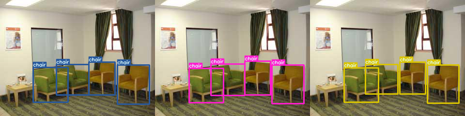
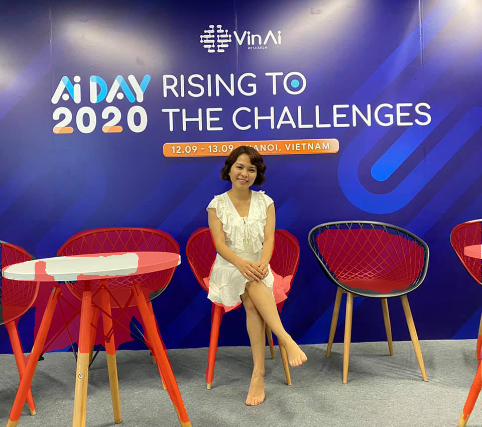
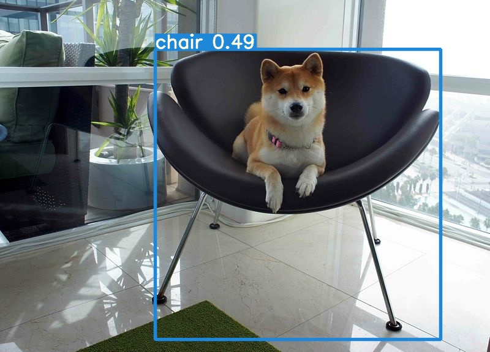

### Let's Grab A Chair!

---




##### Table of Contents

1. [Quick Start! Fun inference in tik-tak](#Quick-Start)
1. [Evaluation Guidelines](#Evaluation-Guidelines)
1. [Training Guidelines](#Training-Guidelines)


---

### Quick Start

Quick inference trained model. Sample reference image folder are `./sample`. All images in this folder are **in the wild** images

In all subsection, I suppose that you're in project folder `/home/ubuntu/adv-cv-class`

`pip install -r requirements.txt`

##### MaskRCNN

```
cd maskrcnn
python3.7 detect_chair.py
```

Predicted images are saved in form *pr_{}.png*.



##### Semantic Segmentation

```
cd semantic_segmentation
python3.7 test.py --datapath /home/ubuntu/thao-adv-cv-class/sample --test
```

Predicted images are saved in `/resnet50_fpn/test/{}.png`


##### Yolov5

```
cd yolov5
python3.7 detect.py --weights runs/exp20/weights/best.pt --source ../sample
```

Predicted imgs will be saved in *inference/output/{}.jpg*



---

### Evaluation Guidelines

##### **ADE20K Preparation**: `python ade20k_convert_validation.py`

This code will convert raw validation set to Chairs Validation Set
Original ADE20K Validation should be in `/home/ubuntu/ADE20K_2016_07_26/images/validation/**/*`
New Chairs Validation set will be saved in `/home/ubuntu/ADE20K_new/val_imgs` and `/home/ubuntu/ADE20K_new/val_segs`
Number of imgs: 2000 imgs (& 2000 masks)/ Estimated time: 1mins40s

##### **MaskRCNN**:

`python3.7 valid.py`

##### **Semantic Segmentation**:

`python3.7 valid.py --test`

##### **Yolov5**:

- Create label as txt file for YOLO:

`python3.7 create_yolo_validation.py`

- Evaluation

`python3.7 valid.py --img 640 --batch 1 --data ./data/chairs.yaml --weights runs/exp20/weights/best.pt --task val  --conf-thres 0.01`

#### Training Guidelines

##### MaskRCNN & Semantic Segmentation:

- Prepare datasset: in `./semantic_segmentation/create_data.ipynb` to create `/home/ubuntu/ADE20K_Chairs_Full/train_imgs` (4827 imgs with segmentation
- Randomly add more ~8k images to `/home/ubuntu/ADE20K_Chairs_Full/train_imgs`
- Run `./semantic_segmentation/add_empty_label.ipynb` to create empty label for images without chairs (return zeros_mask)
- Train: `python3.7 train.py` in each folder

1. Yolov5

- Yolo need special txt file to store label. Simply run notebook `yolov5/create_yolo.ipynb`, all labels for YOLO will created.
- Train: `python3.7 train.py --img 640 --batch 8 --epochs 100 --data ./data/chairs.yaml --cfg ./models/yolov5x_chair.yaml --weights yolov5x.pt`

##### References

My code are heavily borrowed from these awesome source:

- [TORCHVISION OBJECT DETECTION FINETUNING TUTORIAL](https://pytorch.org/tutorials/intermediate/torchvision_tutorial.html)
- [TRANSFER LEARNING FOR COMPUTER VISION TUTORIAL](https://pytorch.org/tutorials/beginner/transfer_learning_tutorial.html)
- [Segmentation Models - Pytorch](https://github.com/qubvel/segmentation_models.pytorch)
- [Mask R-CNN for Object Detection and Segmentation](https://github.com/matterport/Mask_RCNN)
- [YOLOv5](https://github.com/ultralytics/yolov5)